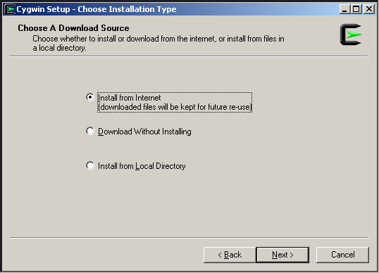

# Getting Started in Windows

## Initial Warning

Programming Vala in Windows it's a little hard at the moment.
Probably Vala it's not the best option for you. Remember there
are plenty of languages and other widget toolkits (this is GTK)
available for Windows. If you still think this is the right
language for you then this guide will help you.

In order to begin programming we'll need to install Gtk+3, Vala and gcc
and all their dependencies.

In Windows this not a trivial task by any means but this document will introduce
you an easy way to start programing Vala in Windows.

The easiest way in Windows is using distribution software and there are 2 options MSYS2 and cygwin.

## Before Start

### Your editor

In order to program it's essential to use an editor. The editor is
the tool which edits the source code and therefore an essential part
of your toolkit. In principle you could use *any* program that can
edit a text file (source files are merely text files) but there is
a detail to be aware. Windows and Unix systems (as Linux and Mac OS)
use a different format to handle text files therefore not any program
would be equally suitable for program in vala.

Because vala is a programming language used mostly in Unix systems
and a lot of resources are available for Unix, it would be a nice
idea use an editor which support Unix's NewLine format.

If you want more information you could read this wikipedia's article
[NewLine](http://en.wikipedia.org/wiki/Newline).

Microsoft's Notepad, only supports Windows NewLine format but if you
try to open files in Unix format the text might be messy on it. So because vala is used mostly in Unix it would be most likely to find
on-line files in Unix format rather than Windows format and thus this
advice.

Some editors capable of read Unix and Windows format:

[Notepad2](http://www.flos-freeware.ch/notepad2.html)

[Notepad++](http://www.notepad-plus-plus.org/)

[Metapad](http://liquidninja.com/metapad/)

[SciTE](http://www.scintilla.org/SciTE.html)

[Gedit](http://ftp.gnome.org/pub/GNOME/binaries/win32/gedit/)

It's up to you choose the proper editor. Some have even syntax highlighting and other interesting features but that goes beyond this
tutorial.

### Internet

This guide assumes you have access to internet.

## Installation of vala in MSYS2

### MSYS2

MSYS2 is a minimal system built over MinGW (minimal Gnu Windows).

MinGW is a minimal environment for the Windows systems consist in the compiler gcc and other utilities (the gnu tool-chain) and libraries
to build software in windows. MSYS2 goes beyond and tries to provide
all the system tools to make easy the development and distribution of software in Windows. It consists in the compiler suite (provided by mingw), a shell provided by bash some system utilities of the project GNU project and a package manager pacman to distribute pre-built packages, this is compiled ready to use.

The MSYS2 [Installation guide](http://sourceforge.net/p/msys2/wiki/MSYS2%20installation/). Please read it.

But unfortunately due some current issues you might want to follow this step by step guide.

1) First get the proper MSYS package for your system.

Get the proper installer from here (this is 32 or 64 bits) [http://msys2.github.io/](http://msys2.github.io/)

You can choose the more recent .exe file.

2) After the download execute the msys2-{*version*}-{*date*}.exe.

<figure>
  
  <figcaption>MSYS2 installation start</figcaption>
</figure>

Next t should ask for a destination **C:\msys32** or **C:\msys64** respectively.

<figure>
  
  <figcaption>MSYS2 path dialog</figcaption>
</figure>

As an advice the path should be the shortest possible and **without
spaces** because they sometimes cause problems. You could choose
another Drive but try to keep the path short and **without spaces**.

After the copy of the files. Tick **Run MSYS2 now**.

<figure>
  
  <figcaption>MSYS2 installation end</figcaption>
</figure>

It should start automatically the MSYS2 shell
if not go to your installation directory and open **msys2_shell.bat**.

The window opened (the MSYS2 shell) is similar to the Windows' command but uses
a program called bash that is used in Unix systems.

<figure>
  
  <figcaption>MSYS2 shell in a XP 32 bits VM</figcaption>
</figure>

It receives any text command, and if it is valid it will execute it, if not
it will emit an error message.

3) Write or copy

    # pacman -Sy
    
<figure>
  
  <figcaption>MSYS2 pacman updating package repositories</figcaption>
</figure>

This command updates the database of pacman (the package system of
MSYS2) if you don't have internet it will emit an error message.

4) Then for update your essential packages

<figure>
  
  <figcaption>MSYS2 pacman updating essential packages</figcaption>
</figure>

    # pacman -S --needed filesystem msys2-runtime bash libreadline libiconv libarchive libgpgme libcurl pacman ncurses libintl
    
5) Exit and open your MSYS2 shell

    # pacman-key --init
    # pacman-key --populate msys2
    # pacman-key --refresh-keys
    # pacman-db-upgrade

<figure>
  
  <figcaption>MSYS2 pacman upating keys database</figcaption>
</figure>

This is done because there's a problem in MSYS2, if you try to update
the packages pacman will claim your packages are corrupted.

6) Update you packages

<figure>
  
  <figcaption>MSYS2 pacman upate</figcaption>
</figure>

    # pacman -Su

Sometimes pacman warns you about conflicting files. The output is usually like this:

    #error: failed to commit transaction (conflicting files)
    #crypt: /usr/share/doc/MSYS/crypt.README exists in filesystem
    #Errors occurred, no packages were upgraded.

In that case add the option --force command and try again

    # pacman -Su --force

<figure>
  
  <figcaption>MSYS2 pacman force upate, after a conflict error</figcaption>
</figure>

### Installing GTK+3 in MSYS2

You will need to install Gtk+3 libraries in order to compile the programs
in this tutorials. Fortunately pacman will help us

On a 32 bits installation the command to do this would be:

    # pacman -S mingw-w64-i686-gtk3 mingw-w64-i686-pkg-config 

On 64 bits

    # pacman -S mingw-w64-x86_64-gtk3 mingw-w64-x86_64-pkg-config

The package mingw-w64-{**version**}-gtk3 installs all the packages needed
for gtk3 and gtk3 itself, the mingw-w64-{**version**}-pkg-config install
pkg-config a tool necessary to locate installed packages in the system,
it warns to the compiler all the info needed to compile correctly the
programs, if not installed it will appear some strange messages.

### Installing Vala and Gcc in MSYS

Valac it's the vala compiler, in this case transforms the vala files
into C files and then gcc transforms them into executables.

On 32 bits:

    # pacman -S mingw-w64-i686-vala gcc

On 64 bits run:

    # pacman -S mingw-w64-x86_64-vala gcc

<figure>
  
  <figcaption>MSYS2 pacman vala installation in one step</figcaption>
</figure>

## Installation of vala in CYGWIN

### CYGWIN

Cygwin is a Unix-like environment and command-line interface for Microsoft Windows. It's an ambitious project to provide a POSIX enviroment in Windows and
thus allow to any software writtern for Unix to be compiled and installed inside
in Cygwin.

1) First go to [https://cygwin.com/install.html](https://cygwin.com/install.html) and grab the installer for your architecture  **setup-x86.exe** or setup-**x86_64.exe**

2) Then launch the setup.

<figure>
  
  <figcaption>cygwin x86 downloader</figcaption>
</figure>

Next.

3) Choose the internet installation.

<figure>
  
  <figcaption>cygwin internet installation</figcaption>
</figure>

Next.

4) Here choose the location. Keep the path installation **without spaces**
because they may cause problems. You can choose any Unit you like, but the path must be short and **without spaces**.

Keep the Recommended, install for ALL USERS.

<figure>
  
  <figcaption>cygwin internet installation</figcaption>
</figure>

Next.

5) This is the temporary location. If you keep the files there you can reintall
from there cygwin instead of using an internet connection. This is useful if
you don't have internet. Any Location will be fine.

<figure>
  
  <figcaption>Here cygwin will put the downloaded files.</figcaption>
</figure>

Next.

6) Choose a mirror.

Next.

7) Here you can select any package you like. We'll need:

Inside Devel: gcc-core and vala
Inside X11: xinit and xorg-server
Inside Libs: libgtk3-devel

<figure>
  
  <figcaption>The packages needed.</figcaption>
</figure>

Next.

8) This window will enumerate all the packages selected. Leave checked the option
for *Select required packages*. This option download all the packages needed for
the packages we had selected.

<figure>
  
  <figcaption>The packages selected for download and install.</figcaption>
</figure>

Next.

9) After the installation you can choose to create the shorcuts.

10) Go to the installation directory and edit the file **Cygwin.bat**. It's a good idea make a back up before.

It should looks like this:

    @echo off
    setlocal
    SET PATH=%PATH%;bin
    SET DISPLAY=:0
    
    C:
    chdir C:\cygwin\bin
    C:\cygwin\bin\run.exe /usr/bin/bash.exe -l -c /usr/bin/startxwin.exe
    bash --login -i

11) Launch your Cygwin either using the **Cygwin.bat** or the shorcut.

It must open 2 Windows.

The black one it's the cygwin terminal.
<figure>
  
  <figcaption>The packages selected for download and install.</figcaption>
</figure>

The other one it's the cygwin xterminal.
<figure>
  
  <figcaption>The packages selected for download and install.</figcaption>
</figure>

Also an X icon should be appeared in the system tray menu.
<figure>
  
  <figcaption>The X Icon it's the cygwin's XWin system tray icon</figcaption>
</figure>

The X icon it's the Xorg server running. If you close it the applications
compiled with gtk won't work so you will need it while you are programming.

Both windows are the cygwin shell, but if you like it you can close the white one and use the black one.

## References and Further Reading

* MSYS2 Official site [Online] Available from: [http://msys2.github.io/](http://msys2.github.io/)
[Accessed 3 November 2014]

* MSYS2 Installing guide. [Online] Available from:
[http://sourceforge.net/p/msys2/wiki/MSYS2%20installation/](http://sourceforge.net/p/msys2/wiki/MSYS2%20installation/)
[Accessed 3 November 2014]

* Cygwin User Guide. [Online] Available from:[https://cygwin.com/cygwin-ug-net.html](https://cygwin.com/cygwin-ug-net.html)
[Accessed 3 November 2014]
* Vala Tools. [Online] Available from:
[https://wiki.gnome.org/Projects/Vala/Tools](https://wiki.gnome.org/Projects/Vala/Tools)
[Accessed 16 September 2014]
## Additional Reading

* How to build your GTK+ application on Windows. [Online] Available from:
[http://blogs.gnome.org/nacho/2014/08/01/how-to-build-your-gtk-application-on-windows/](http://blogs.gnome.org/nacho/2014/08/01/how-to-build-your-gtk-application-on-windows/)
[Accessed 3 November 2014]
* Pacman manpages. [Online] Available from: [http://www.archlinux.org/pacman/pacman.8.html](https://www.archlinux.org/pacman/pacman.8.html)
[Accessed 3 November 2014]

* Bash manpages. [Online] Available from: [http://linux.die.net/man/1/bash](http://linux.die.net/man/1/bash)
[Accessed 3 November 2014]
